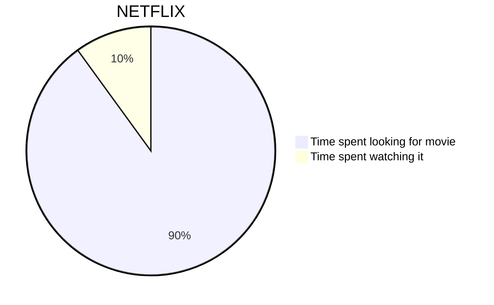
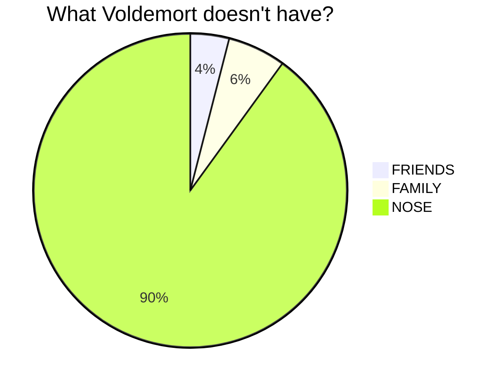
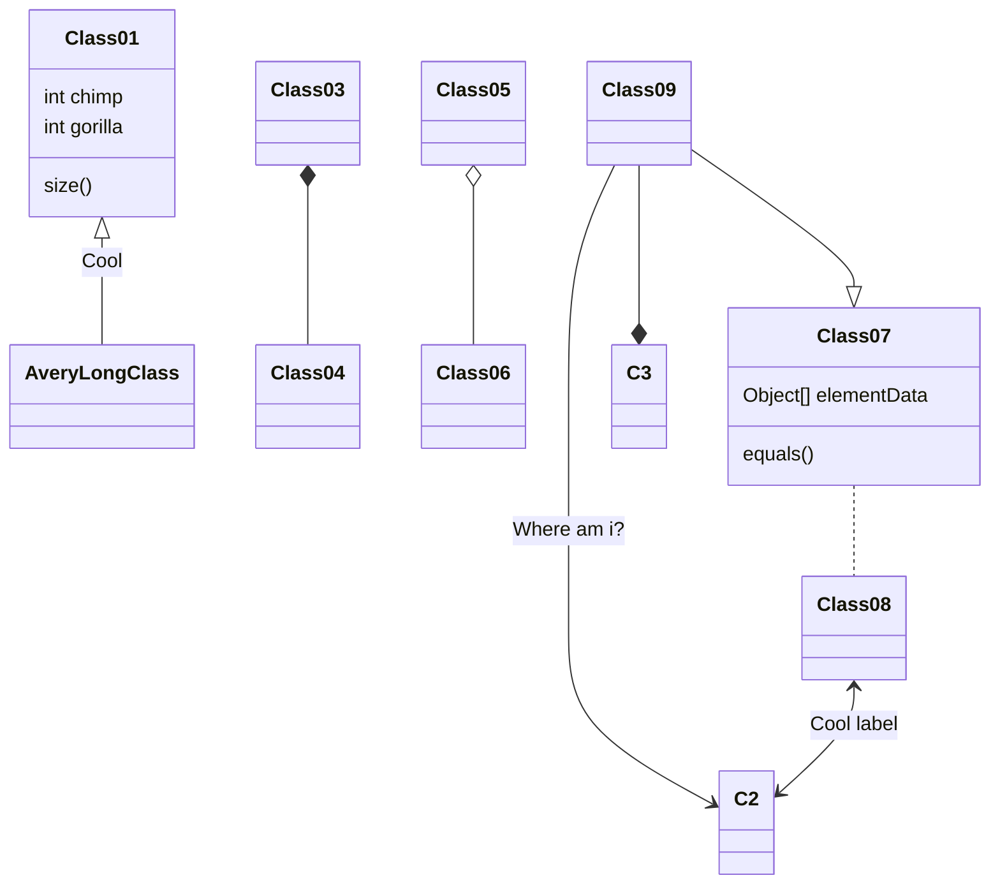

# 其他图表
## 数学公式

### 行内
Euler's identity $e^{i\pi}+1=0$ is a beautiful formula in $\mathbb{R}^2$.
### 段落

假设 $y >= 0$ , 而 $[\log x]$ 表示 $\log x$ 的整数部分, 设:

$$\Phi (y) = \frac {1} {2 \pi i} \int_{2 - i \infty}^{2 + i \infty} \frac {y^{\omega} \mathrm{d} \omega} {\omega \left(1 + \frac {\omega} {(\log x)^{1.1}}\right)^{[ \log x ] + 1}}, x > 1$$

显见， 当 $0 <= y <= 1$ 时， 有 $\Phi(y) = 0$. 对于所有 $y >= 0$, 则 $\Phi(y)$ 是一个非减函数.

当 $\log x>= 10^4$ 及 $y>= e^{2{(\log x)}^{-0.1}}$ 时， 则有:

$$1 - x^{- 0.1} <= \Phi (y) <= 1


## 普通图表







## 序列图

```sequence
战士->领导: 首长好
Note right of 领导: 首长复杂的内心活动
领导-->战士: 同志们好
战士->>领导: 为人民服务
```

## 类图



```mermaid
graph lR
Documentation-->cccc[is Awesome]
```


Welcome to the algorithm wiki!

只是测试


{
    "data": {
        "type": "bar",
        "columns": [
            ["data1", 30, 200, 100, 400, 150, 250],
            ["data2", 50, 20, 10, 40, 15, 25]
        ],
        "axes": {
            "data2": "y2"
        }
    },
    "axis": {
        "y2": {
            "show": true
        }
    }
}

ddddddd


{
    "xAxis": {
        "type": "category",
        "data": ["Mon", "Tue", "Wed", "Thu", "Fri", "Sat", "Sun"]
    },
    "tooltip": "{}",
    "yAxis": {
        "type": "value"
    },
    "series": [{
        "data": [820, 932, 901, 934, 1290, 1330, 1320],
        "type": "line"
    }]
}


sssssss


{
    "data": {
        "type": "bar",
        "columns": [
            ["data1", 30, 200, 100, 400, 150, 250],
            ["data2", 50, 20, 10, 40, 15, 25]
        ],
        "axes": {
            "data2": "y2"
        }
    },
    "axis": {
        "y2": {
            "show": true
        }
    }
}



{
    "title": "1/x * cos(1/x)",
    "grid": true,
    "xAxis": {
        "domain": [0.01, 1]
    },
    "yAxis": {
        "domain": [-100, 100]
    },
    "data": [{
        "fn": "1/x * cos(1/x)",
        "closed": true
    }]
}


```chart
{
    "title": {
        "text": "Fruits number"
    },
    "tooltip": {},
    "legend": {
        "data":["Number"]
    },
    "xAxis": {
        "data": ["Apple","Banana","Peach","Pear","Grape","Kiwi"]
    },
    "yAxis": {},
    "series": [{
        "name": "Number",
        "type": "bar",
        "data": [5, 20, 36, 10, 10, 20]
    }]
}
```


{
    "title": {
        "text": "Fruits number"
    },
    "tooltip": {},
    "legend": {
        "data":["Number"]
    },
    "xAxis": {
        "data": ["Apple","Banana","Peach","Pear","Grape","Kiwi"]
    },
    "yAxis": {},
    "series": [{
        "name": "Number",
        "type": "bar",
        "data": [5, 20, 36, 10, 10, 20]
    }]
}


Code mode:

```chart
{
    "width": "900px",
    "height": "500px",
    "title": {
        "text": "Fruits number"
    },
    "tooltip": {},
    "legend": {
        "data":["Number"]
    },
    "xAxis": {
        "data": ["Apple","Banana","Peach","Pear","Grape","Kiwi"]
    },
    "yAxis": {},
    "series": [{
        "name": "Number",
        "type": "bar",
        "data": [5, 20, 36, 10, 10, 20]
    }]
}
```
