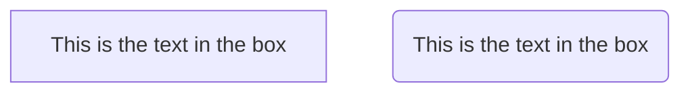
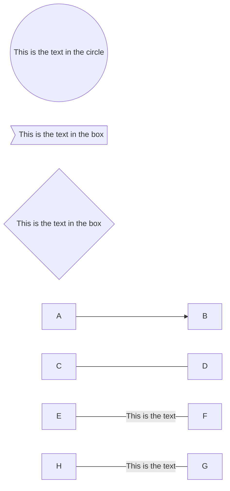
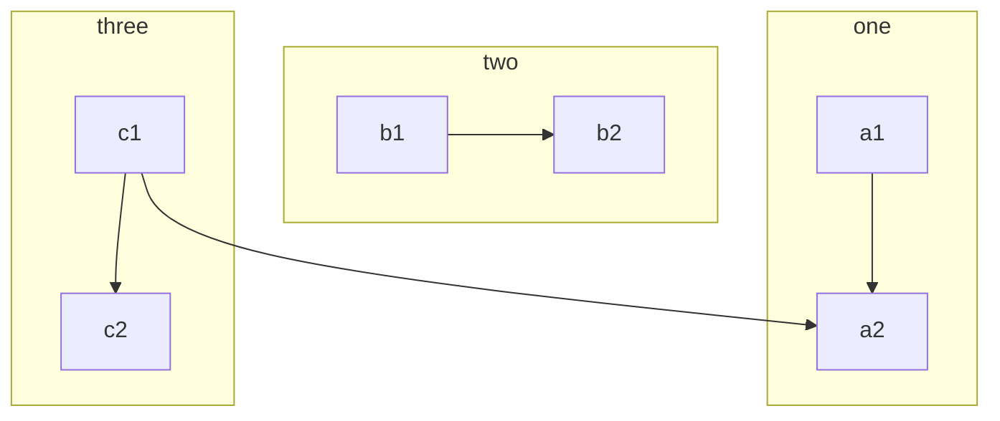
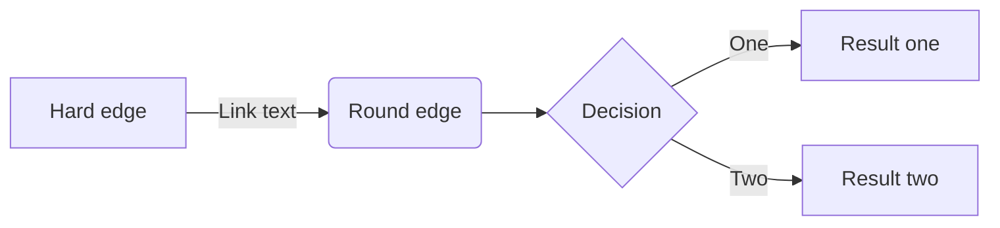
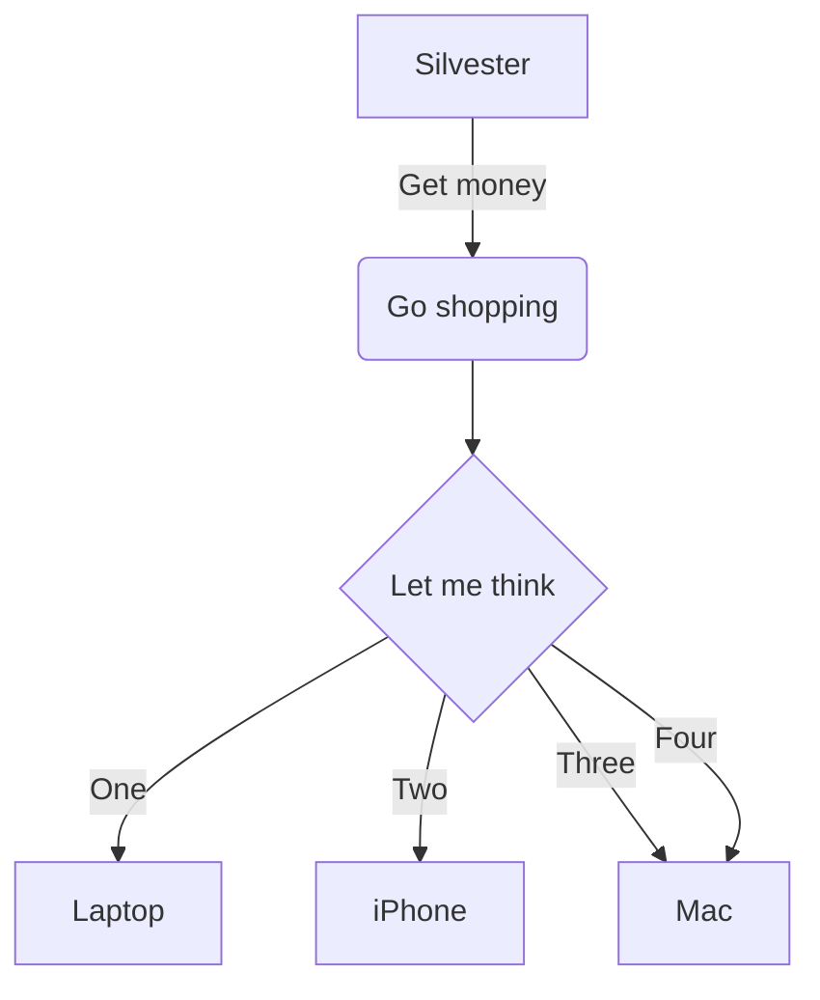
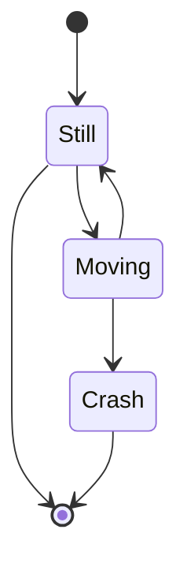

# 流程图

## 基本元素

```mermaid
graph TD
   
     id1[This is the text in the box]
      id2(This is the text in the box)
     

```

```mermaid
graph LR
    id1((This is the text in the circle))
      id2>This is the text in the box]
    id3{This is the text in the box}
     A-->B
       C --- D
          E-- This is the text ---F
          
           H---|This is the text|G
```

## 节点关系

```mermaid
graph TB
    c1-->a2
    subgraph one
    a1-->a2
    end
    subgraph two
    b1-->b2
    end
    subgraph three
    c1-->c2
    end
```

```mermaid
graph LR
    A[Hard edge] -->|Link text| B(Round edge)
    B --> C{Decision}
    C -->|One| D[Result one]
    C -->|Two| E[Result two]
```

```mermaid
graph TD
  A[Silvester] -->|Get money| B(Go shopping)
  B --> C{Let me think}
  C -->|One| D[Laptop]
  C -->|Two| E[iPhone]
  C -->|Three| F[Car]
  C -->|Four| F[Mac]
```

```mermaid
stateDiagram
  [*] --> Still
  Still --> [*]
  Still --> Moving
  Moving --> Still
  Moving --> Crash
  Crash --> [*]
```